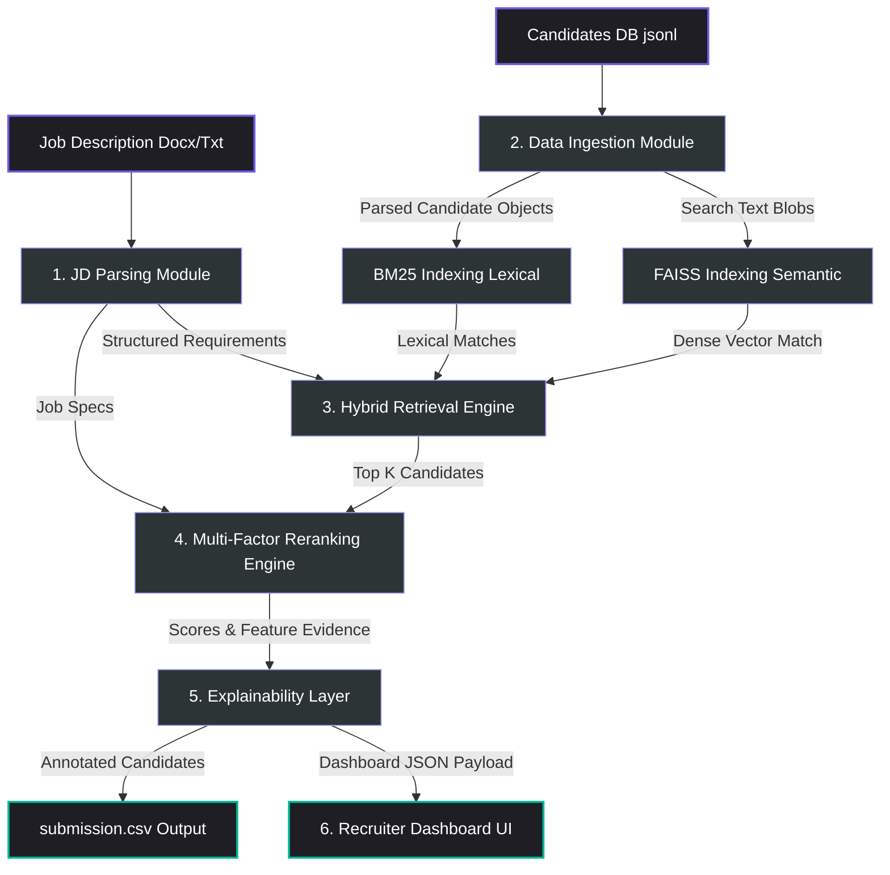

# 🏗️ Redrob AI — System Architecture & Design Specification

This document details the architectural design, algorithmic details, scoring formulas, and frontend/backend integration of the **Redrob AI Candidate Intelligence & Reranking System**.

---

## 🗺️ System Pipeline Overview

The system utilizes a **Retrieve-then-Rerank** design pattern, commonly used in production-grade information retrieval and recommendation systems. It splits the processing of 100,000+ candidate profiles into a 4-stage pipeline (comprising 6 architectural modules) to balance query latency with deep profile reasoning.

---

## 🛠️ Module Breakdowns

### 1. Job Description Requirements Parser (`jd_parser` module)
* **File Location**: [parser.py](file:///d:/Program_files_3/India.Runs%20Hack/ranker/jd_parser/parser.py)
* **Mechanism**: Reads input file types (supports raw text and `.docx` using `python-docx`). It uses regular expressions and pattern extractors to segment the job description text:
  - **Role Title & Company**: Extracted from header lines.
  - **Experience range**: Identifies bounds (e.g., matching expressions like `X-Y years` or `at least X years`).
  - **Must-Have & Nice-to-Have Skills**: Cross-references pre-compiled technology/ML skill keyword sets with structured JD sections.
  - **Location & Work Mode**: Scans for Indian cities and remote identifiers (`wfh`, `work from home`, `distributed`).
  - **Behavioral/Cultural Signals**: Identifies work ethics (e.g., "shipper mentality", "product company background").

---

### 2. Data Ingestion & Preprocessing (`data_ingestion` module)
* **File Location**: [loader.py](file:///d:/Program_files_3/India.Runs%20Hack/ranker/data_ingestion/loader.py)
* **Mechanism**: Standardizes the ingestion of candidate profiles:
  - Parses structured entities: `CareerEntry`, `Education`, `Skill`, and `RedrobSignals` (platform activity and response rate metrics).
  - Constructs a flattened **Search Text Blob** per candidate. This combines the headline, summary, skills (with proficiency levels), career history (titles, descriptions, industries), and education (degrees, majors, institutions).
  - Normalizes metrics like total years/months of experience, lowercases skills for exact match computations, and extracts metadata caches.

---

### 3. Hybrid Search Retriever (`retrieval` module)
* **File Location**: [retriever.py](file:///d:/Program_files_3/India.Runs%20Hack/ranker/retrieval/retriever.py)
* **Mechanism**: 
  - **Lexical BM25 (Okapi)**: Tokenizes the search query and candidates' text blobs, indexing them via `rank_bm25`. This ensures candidates who explicitly mention specific niche tools or keywords are retrieved.
  - **Dense Semantic Retrieval**: Computes dense sentence embeddings using the SentenceTransformers model `all-MiniLM-L6-v2` (384-dimensional space). It trains a FAISS (Facebook AI Similarity Search) index flat or IVF (Inverted File Index) on candidate vectors. IVF is automatically deployed when the candidate set exceeds 10,000 to maintain sub-millisecond retrieval speeds.
  - **Hybrid Combination**: Combines normalized lexical and semantic scores:
    
    $$S_{retrieval} = 0.40(S_{bm25}) + 0.60(S_{semantic})$$
    
    The top $K$ candidates (default: 1,000) are routed to the reranker.

---

### 4. Deterministic Multi-Factor Reranker (`reranker` module)
* **File Location**: [scorer.py](file:///d:/Program_files_3/India.Runs%20Hack/ranker/reranker/scorer.py)
* **Mechanism**: Recomputes candidate relevance using a 7-factor scoring engine:

$$\text{FinalScore} = \sum_{i=1}^{7} w_i \cdot F_i$$

#### Reranking Feature Definitions ($F_i$)
1. **Semantic Fit ($F_1$, weight: 35%)**: Normalized similarity score obtained from semantic vector models.
2. **Must-Have Coverage ($F_2$, weight: 20%)**: Exact match rate of candidate skills against JD must-haves. Checks both structured skill list and parsed career history text.
3. **Experience Fit ($F_3$, weight: 15%)**: 
   - Perfect score ($1.0$) if the candidate's years of experience fall within the JD range.
   - Fractional penalty ($\max(0.3, \text{exp} / \text{min\_required})$) if under-experienced.
   - Gentle penalty ($\max(0.5, 1.0 - \text{over\_ratio} \cdot 0.2)$) if over-experienced (to limit over-qualification).
4. **Role Fit ($F_4$, weight: 10%)**: Extracted tokens from JD title compared against candidate's current and historical titles. Includes bonus points for titles containing `Senior` or `Engineer`.
5. **Recency ($F_5$, weight: 10%)**: High score ($1.0$) if the current title is relevant or if the candidate held relevant roles within the last 24 months.
6. **Behavioral Signals ($F_6$, weight: 5%)**: Measures candidate responsiveness, profile completion rate, and platform endorsement count on the Redrob platform.
7. **Bonus Fit ($F_7$, weight: 5%)**: Percentage match of "nice-to-have" skills explicitly declared in the JD.

---

### 5. Transparent Explainability Layer (`explainability` module)
* **File Location**: [explainer.py](file:///d:/Program_files_3/India.Runs%20Hack/ranker/explainability/explainer.py)
* **Mechanism**: 
  - Reads the exact evidence arrays collected during the Reranker execution (avoids generating text from scratch via generative models to eliminate hallucinations).
  - Aggregates features: lists top matching skills, exact years of experience, current title, and key strengths/concerns.
  - Dynamically formats a recruiter-readable summary:
    `Knows PyTorch, Elasticsearch +2 more; 6.0yr experience; Current: AI Engineer; Strong semantic match`

---

### 6. Recruiter Dashboard Interface (`frontend` React Web App)
* **System Design**: A modern React SPA built on Vite, designed with Tailwind CSS v4.
* **Key Components**:
  - **Dashboard Entry**: [App.jsx](file:///d:/Program_files_3/India.Runs%20Hack/ranker/frontend/src/App.jsx) binds data feeds and coordinates header/table subcomponents.
  - **Three.js Particle Field**: [ThreeBackground.jsx](file:///d:/Program_files_3/India.Runs%20Hack/ranker/frontend/src/components/ThreeBackground.jsx) uses React Three Fiber (`@react-three/fiber` and `@react-three/drei`) to render interactive particle streams and revolving orbital rings. This represents visual candidate clustering in low-dimensional vector space.
  - **Dynamic Table**: [CandidateTable.jsx](file:///d:/Program_files_3/India.Runs%20Hack/ranker/frontend/src/components/CandidateTable.jsx) features debounce-controlled instant text searching, sort functions (by rank or score), and pagination filters.
  - **Candidate Modal**: [CandidateModal.jsx](file:///d:/Program_files_3/India.Runs%20Hack/ranker/frontend/src/components/CandidateModal.jsx) slides into view using Framer Motion and GSAP, displaying individual score breakdowns, skill coverage metrics, and detailed candidate profiles.

---

## ⚖️ Core Design Trade-offs & Architecture Choices

| Architectural Option Considered | Selected Implementation | Trade-off Rationale |
|---|---|---|
| **Pure LLM-based Candidate Ranking** | **Retrieve-then-Rerank (FAISS + Heuristic Weights)** | LLMs are slow and expensive for large candidate pools. Retrieving first via FAISS/BM25 and scoring via Python takes seconds and is highly reproducible. |
| **Pure Embedding Cosine Similarity** | **Hybrid Vector + Lexical Search** | Embeddings are excellent at synonyms but struggle with exact code terms/tools (e.g. matching `all-MiniLM` vs. `sentence-transformers`). BM25 ensures exact technology matches. |
| **Generative Reason Explanations** | **Heuristic Evidence Explainer** | Generative models can hallucinate candidate capabilities. A structured evidence formatter guarantees explanations are 100% accurate, based on data points from the parser. |
| **Traditional Server API Backend** | **Vite Static App with Precompiled Data** | A static web application loading a JSON export is fast, runs client-side, is portable for hackathon judging, and requires zero deployment configuration. |
